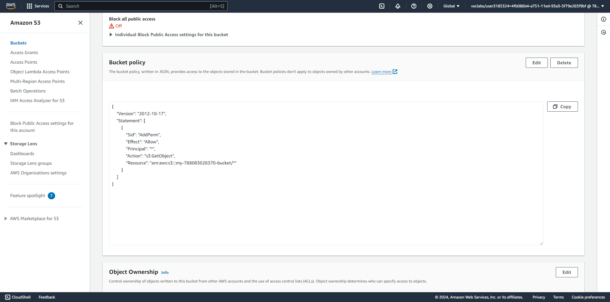

# Deploy Static Website on AWS

In this project, I will deploy a static website to AWS using S3, CloudFront, and IAM.

## Website URL: d2d31cis1j6gs6.cloudfront.net
[Travel Blog](d2d31cis1j6gs6.cloudfront.net)

## The files included are: 

- index.html - The Index document for the website.
- /img - The background image file for the website.
- /vendor - Bootssrap CSS framework, Font, and JavaScript libraries needed for the website to function.
- /css - CSS files for the website.

## Steps:
### 1. Create S3 bucket with public access

### 2. Upload folders and index.html to bucket

### 3. Add permission to S3 bucket

### 4. Config static website hosting

### 5. Distribute website via CloudFront

### 6. Access website in chorme
- With CloudFront domain d2d31cis1j6gs6.cloudfront.net

- With bucket endpoint http://my-788083028370-bucket.s3-website-us-east-1.amazonaws.com/

- With object file index.html endpoint
